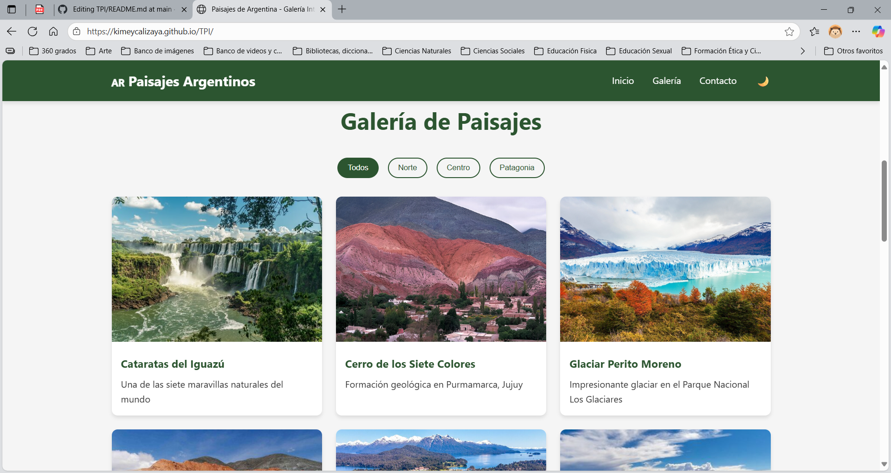
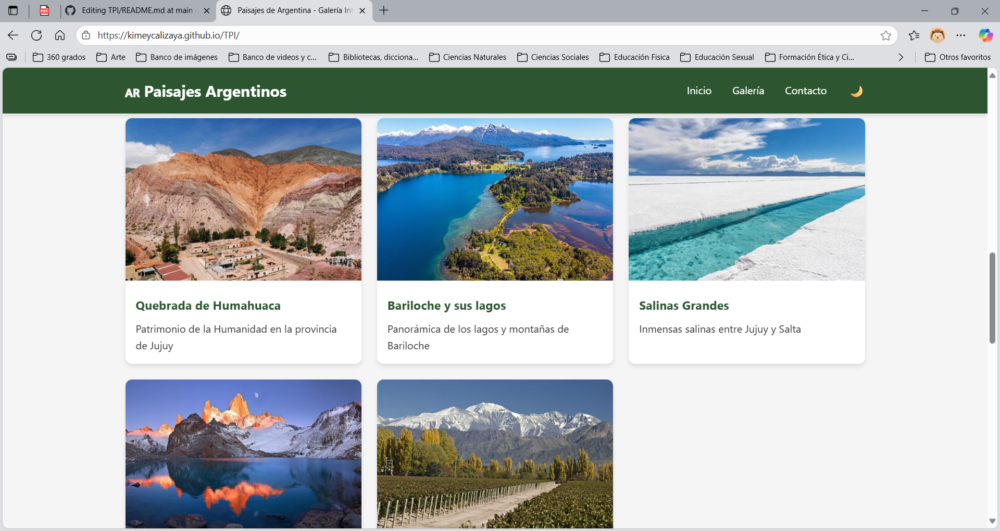
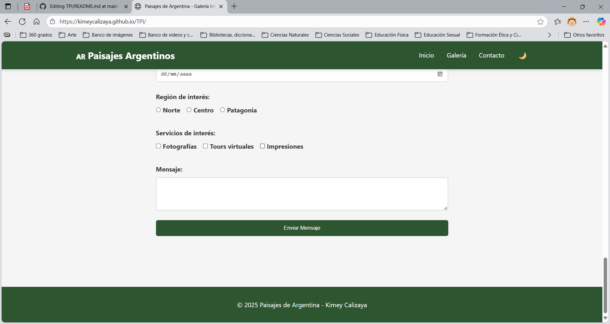

# Galeria Interactiva - [Kimey Calizaya]

## Descripción
Funcionalidades Principales
Galería Interactiva con lightbox y navegación

Diseño 100% Responsive (4 breakpoints)

Modo Oscuro/Claro con persistencia

Sistema de Filtros por regiones

Formulario de Contacto con validación en tiempo real

PWA (Progressive Web App) instalable

## Tecnologías Utilizadas
- HTML5 semántico
- CSS3 (Flexbox/Grid)
- JavaScript ES6+

## Funcionalidades Implementadas
### ✅ Requisitos Mínimos
- [ ] 4 páginas HTML con estructura semántica
- [ ] Maquetación con Flexbox/Grid
- [ ] Formulario avanzado con validación
- [ ] Diseño responsive (4 breakpoints)
- [ ] Dark/Light mode persistente

## Integrante del Grupo
-Kimey Calizaya

## Capturas de Pantalla

